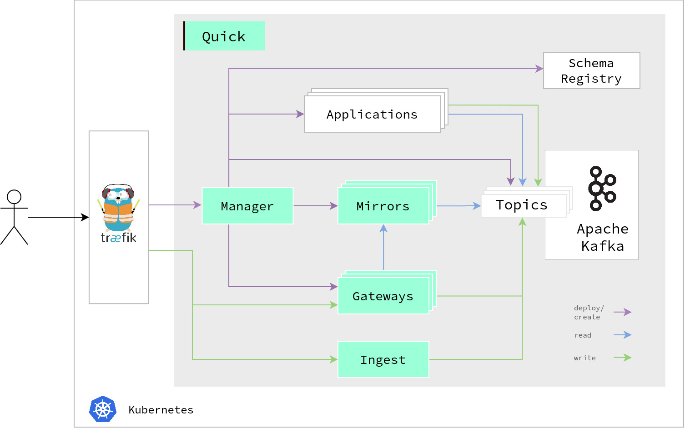

# Architecture

Quick has the following high-level architecture:



The system is deployed in Kubernetes.
We use Traefik as an ingress load balancer that can route to the manager, ingest service, and gateways.
Since Quick central functionality is built on top of Kafka, we also use it to store any metadata.

## Traefik

We use Traefik as a load balancer.
For routing, Traefik is configured through two K8s resources: `Ingress` and `Middleware`.
An ingress defines a path to service mapping, e.g., `demo.d9p.io/manager` should go to the manager service.
The ingress is annotated with a middleware:

```yaml
apiVersion: networking.k8s.io/v1
kind: Ingress
metadata:
  annotations:
    traefik.ingress.kubernetes.io/router.middlewares: quick-demo-service-stripprefix@kubernetescrd
```

We use the middleware to strip prefixes from the path.
For instance, we can access GraphQL of the gateway `demo` through `https://demo.d9p.io/gateway/demo/graphql`.
The middleware ensures that Traefik forwards this request to `http://quick-gateway-demo/graphql`.

For gateways, the manager has to deploy those resources.


## Manager

The manager handles user requests from the [CLI](../user/reference/cli-commands.md).
Most tasks are therefore based on k8s resources.
We use a templating engine for a new resource that creates the respective YAML strings.
The strings are then loaded into [fabric8io k8s client's](https://github.com/fabric8io/kubernetes-client) models and
sent to the k8s API.

Additionally, the manager has administrative-like tasks:
* deployment of the topic registry at startup
* deletion of succeeded jobs


## Ingest

The ingest service is an HTTP service for ingesting data into a Kafka topic.
As this requires serializers for the keys and values, we need to know which to use.
The ingest service requests (and caches) this information from the topic registry.
Further, when a topic is immutable in the topic registry, the ingest service first checks its mirror.


## Mirror

Mirrors are Kafka Streams applications that read the content of a topic and expose it through a key-value REST API.
See our [our blog post](https://medium.com/bakdata/queryable-kafka-topics-with-kafka-streams-8d2cca9de33f) for more information on why we use this approach.
A mirror is automatically deployed when the user creates a new topic.

## Gateway

The gateway is Quick's implementation for the GraphQL server.
The user can apply a schema to it through the manager.


## Common

All our subprojects share a library called `common`.
The package contains code that is used throughout the projects, including:

* exception-handling
* configs
* security (API-Key)
* API models
