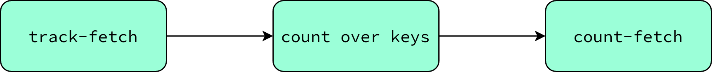

# TinyURL

TinyURL is an application that shortens any given URL to a tiny one.
For instance, shortening URLs is helpful for people posting on Twitter.
This example shows a step-by-step guide on how to run your TinyURL application with Quick.

## What this will demonstrate
- the use of topics without duplicates
- the deployment of a simple topology running an analytics app from Docker Hub
- the creation and setup of a gateway
- the retrieval of user input (tiny URLs) and analytics results (token lookup count)

## Prerequisites

- A running Quick instance.
  See the [Setup Quick](../getting-started/setup-quick.md) section.
- You should have [quick-cli](https://github.com/bakdata/quick-cli) installed and initialized.
  See the [Setup Quick CLI](../getting-started/setup-cli.md) section.

## Setup and installation
Create a new gateway called `tiny-url-gateway`:
```shell
quick gateway create tiny-url-gateway
```
!!! Attention
    When you create a gateway, it might take some time until the gateway is running.

Apply the GraphQL schema on the `tiny-url-gateway` by using the following command:
```shell
quick gateway apply tiny-url-gateway -f schema.gql
```
??? "The TinyUrl's gateway schema (`schema.gql`)"
      ```graphql title="schema.gql"
        type Query {
            fetchCountOfToken(token: String): TinyUrlCount
            fetchAll: [TinyUrl] @topic(name: "tiny-url")
        }
        
        type TinyUrl {
            token: String!
            url: String!
        }
        
        type TinyUrlCount {
            tinyUrl: TinyUrl @topic(name: "tiny-url", keyArgument: "token")
            count: Long @topic(name: "count-fetch", keyArgument: "token")
        }
      ```
Create a new topic called `tiny-url`.
This topic stores the tokens as its key along with the URLs as its value.
```shell
quick topic create tiny-url --key string --value schema --schema tiny-url-gateway.TinyUrl --immutable
```
!!! Note
    The `--immutable` flag. This flag determines that the topic is immutable, so there will be no duplicate keys.


We use a simple Kafka streams application that aggregates the keys in the `track-fetch` topic.
In other words, the application counts how many times the users fetch the TinyURLs.

You can find the source code of the counter application [in our GitHub repository](https://github.com/bakdata/quick-examples/tree/main/tiny-url/counter).
The diagram below shows the topology of the Kafka streams application.

The topology uses a source topic called `track-fetch` and a sink topic called `count-fetch`:


Create the two topics `track-fetch` and `count-fetch` with the following commands:
```shell
quick topic create track-fetch --key string --value string &&
quick topic create count-fetch --key string --value long
```

In the last step, you can use Quick to deploy your application:
```shell
quick app deploy tiny-url-counter \
    --registry bakdata \
    --image quick-demo-tinyurl \
    --tag 1.0.0 \
    --args input-topics=track-fetch output-topic=count-fetch productive=false
```

## Ingest and fetch TinyURLs

After successfully setting up the application, topics, and gateway, it's time to create a TinyURL, a URL associated with its token.
To do so, you just ingest a key/value (token as the key and URL as the value) in the `tiny-url` topic:
```shell
curl --request POST --url "$QUICK_URL/ingest/tiny-url/" \
  --header 'content-type: application/json' \
  --header "X-API-Key: $QUICK_API_KEY" \
  --data '@./tiny-urls.json'
```

??? "The TinyUrl's example data (`tiny-urls.json`)"
      ```json title="tiny-urls.json"
         [
             {
                 "key": "d9p",
                 "value": {
                     "token": "d9p",
                     "url": "https://www.d9p.io"
                 }
             },
             {
                 "key": "bak",
                 "value": {
                     "token": "bak",
                     "url": "https://bakdata.com/"
                 }
             }
         ]
      ```

Now you can simulate the tracking of a user's URL fetch by the URL token. Run the command below:
```shell
curl --request POST --url "$QUICK_URL/ingest/track-fetch/" \
  --header 'content-type: application/json' \
  --header "X-API-Key: $QUICK_API_KEY" \
  --data '{"key": "d9p", "value": ""}'
```

Then, the `quick-demo-tinyurl` app counts how many times the same key was ingested into the topic `track-fetch`
and outputs the number as a value in the output topic `count-fetch`.

### Query user inputs

You can query the all the ingested TinyUrls using the query below:
```graphql
query {
    fetchAll {
        token
        url
    }
}
```
### Query results

Imagine users fetched the token `d9p` URL twice.
[Query](../getting-started/working-with-quick/query-data.md) the data and see the results:

```graphql
query {
    fetchCountOfToken(token: "d9p") {
        tinyUrl {
            url
        }
        count
    }
}

```

The output should be:

```json
{
  "data": {
    "fetchCountOfToken": {
      "url": "https://www.d9p.io",
      "count": 2
    }
  }
}
```

## Teardown resources

To delete all the resources, follow these steps:

Delete counter application:
```shell
quick app delete tiny-url-counter
```
Delete topics:
```shell
quick topic delete tiny-url && 
quick topic delete track-fetch && 
quick topic delete count-fetch
```
Delete gateway:
```shell
quick gateway delete tiny-url-gateway
```