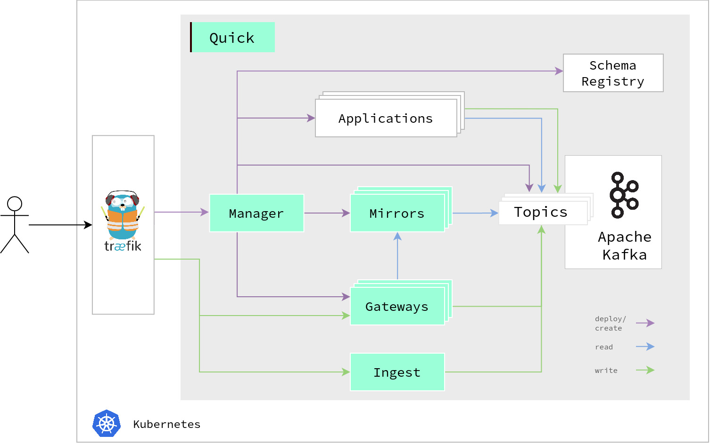

# Quick user guide

!!! warning "Important information"

    We are currently rethinking Quick's approach and are moving from applications to composable libraries.
    Subsequently, we are deprecating the CLI and the applications like the Manager and Ingest service,
    and there will be less development activity during this period.

    We instead focus on providing you the tools to integrate live data from Kafka in your GraphQL server.
    The libraries will offer a similar set of features as Quick does now,
    but allow you to integrate it with your custom solutions.
    To expose the data from Kafka, this includes:

    - creating different types of Kafka Stream indexes
    - providing information about the partitioning
    - applying the GraphQL field selection to Avro and Protobuf objects in your index.

    To then query the data from a GraphQL server, the library provides:

    - clients for querying different index types
    - pre-computed routing to the replica that holds the queried key.

    If you have any questions or feedback,
    feel free to [open an issue](https://github.com/bakdata/quick/issues/new/)
    or contact us by mail ([contact@d9p.io](mailto:contact@d9p.io)).

## What is Quick?

Quick orchestrates your data as a real-time stream of events.
It helps you to run and maintain your apps on your data streams
and exposes GraphQL APIs connecting the data streams to applications and devices.

Quick runs in a [Kubernetes](https://kubernetes.io/) cluster and on top of [Apache Kafka](https://kafka.apache.org/)
The manager creates, modifies, and deletes other resources.
You interact with it through the [CLI](getting-started/setup-cli).

First, you can create topics in Apache Kafka that hold all your data.
Quick provides an ingest service with a REST API to get data into your topics.
For processing the data,
the manager lets you deploy [Kafka Streams](https://kafka.apache.org/documentation/streams/) applications in the cluster.
They read data from topics, process it, and write it back to a topic.

When you then want to query the data of Apache Kafka topics, you can use the gateway.
The gateway is a [GraphQL](https://graphql.org/) server.
You can apply a GraphQL schema to it that describes the data of your topic.
With the help of mirrors, the gateway can then efficiently query their content.
Next to querying data, it also supports ingesting data through a GraphQL interface.

## User guide

The user guide is split into three parts:

- [Getting Started](getting-started)
- [Examples](examples)
- [Reference](reference)

If you have never worked with Quick, we suggest jumping into the [getting started section](getting-started).
It gives an overview of how to set up Quick and its CLI and shows the first steps when working with it.
The guide also provides [examples](examples) showcasing more complex use cases of Quick.
The [reference](reference) describes Quick's different parts in depth.
